基于Springboot的酒店管理系统
=

### 完整代码获取地址：从戎源码网 ([https://armycodes.com/](https://armycodes.com/))
### 作者微信：19941326836  QQ：952045282 
### 承接计算机毕业设计、Java毕业设计、Python毕业设计、深度学习、机器学习
### 选题+开题报告+任务书+程序定制+安装调试+论文+答辩ppt 一条龙服务
### 所有选题地址https://github.com/nature924/allProject

一、项目介绍
---

基于SpringBoot框架的酒店管理系统，系统角色为管理员、操作员、普通用户，主要功能如下

管理员：
基本操作：登录、修改密码、获取/修改个人信息
仪表盘/统计：订单统计、入住率（occupancy-rate）、各类计数统计
用户管理：筛选用户、查看用户详情、新增用户、修改用户、删除用户、获取用户相关统计
员工/操作员管理：新增/修改/删除/查询操作员信息、角色分配
角色权限管理：新增角色、查看/修改角色权限、删除角色、获取角色列表
菜单管理：新增菜单、获取菜单列表、查看菜单详情
房型管理：查询房型、查看房型详情、新增房型、修改房型、删除房型
房间管理：筛选房间、获取房间列表、查看房间详情、新增房间、修改房间、删除房间、按状态/类型筛选房间
房间物品管理：房间物品增删改查、物品详情
订单管理（后台）：查询订单列表、订单新增/修改/删除、支付处理、取消订单、超时处理、按用户/条件查询订单
入住/退房管理：办理入住、办理退房、入住记录管理
酒店信息维护：更新酒店基本信息
部门管理：部门增删改查、查询部门详情

后台（操作员）：
基本操作：登录、修改密码、获取/修改个人信息
订单处理：新增订单、支付、取消、超时处理、查询用户订单
入住/退房：办理入住、办理退房、查看入住记录
房间与房型管理（操作视图）：查看/筛选房间与房型、更新房间状态（占用/空闲/维修）、房间详情查看
房间物品管理：发布/修改物品记录、查看物品列表
用户查询：按需查询用户与订单信息

普通用户（hotel-user）：
基本操作：注册、登录、修改密码、获取/修改个人信息、登出
浏览与预订：查看酒店信息、浏览房型与房间、查看房间详情、下单预订
订单管理（用户端）：新增订单、查看订单列表与详情、取消订单、支付订单、查询历史订单
个人中心：查看/修改个人资料、查看订单记录

二、项目技术
---
- 编程语言：Java
- 数据库：MySQL
- 项目管理工具：Maven
- 前端技术：VUE、HTML、Jquery、Bootstrap
- 后端技术：Spring、SpringMVC、MyBatis

三、运行环境
---
- 操作系统：Windows、macOS都可以
- JDK版本：JDK1.8以上都可以
- 开发工具：IDEA、Ecplise、Myecplise都可以
- 数据库: MySQL5.7以上都可以
- Tomcat：任意版本都可以
- Maven：任意版本都可以

四、运行截图
---

### 程序截图：
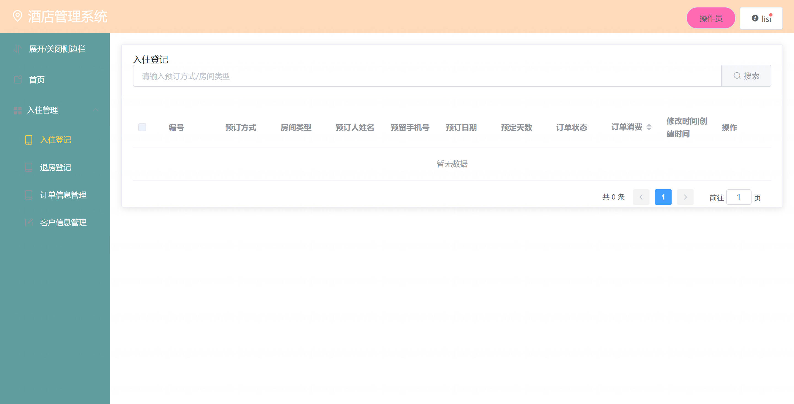
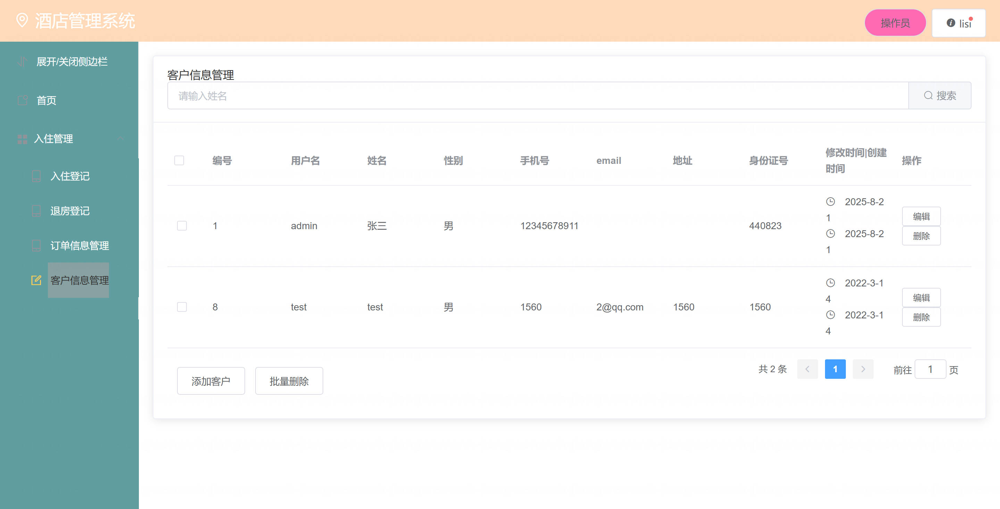
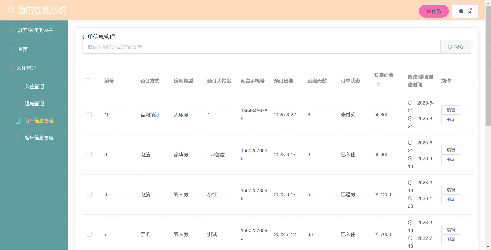
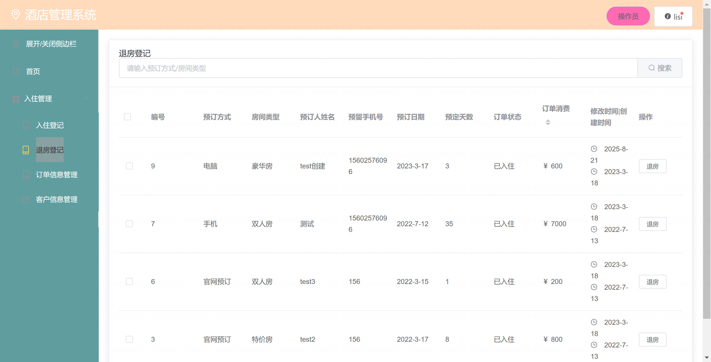
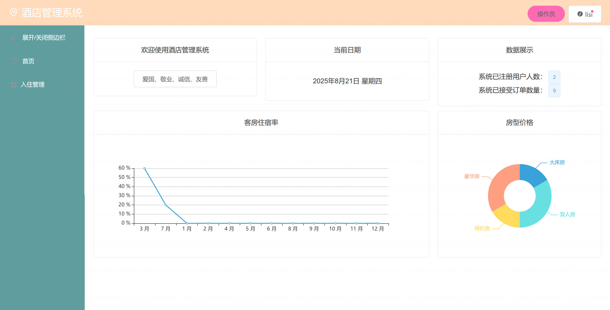
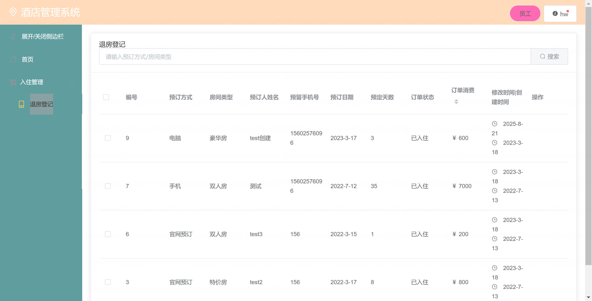
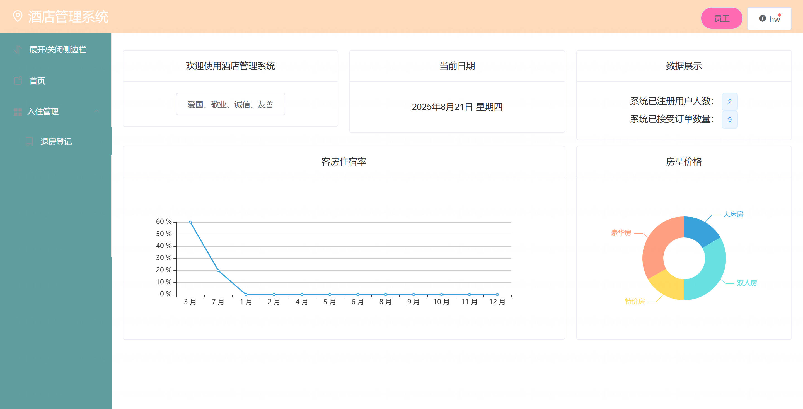
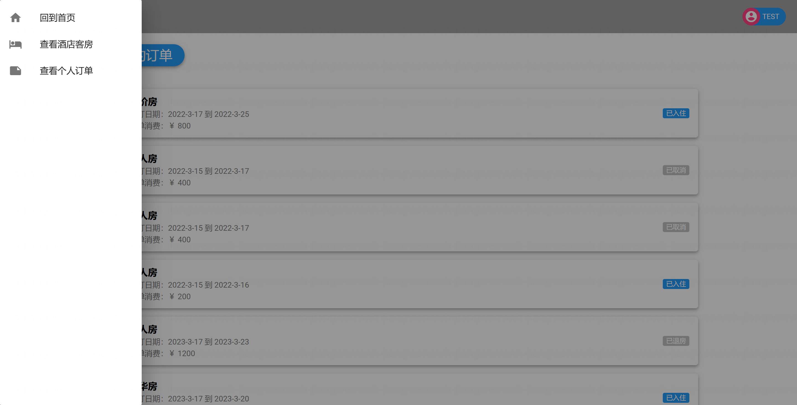
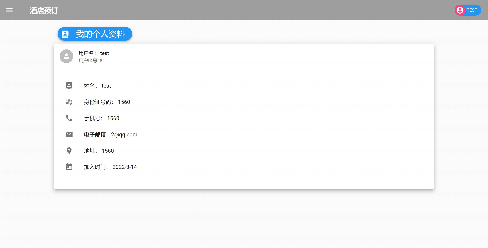
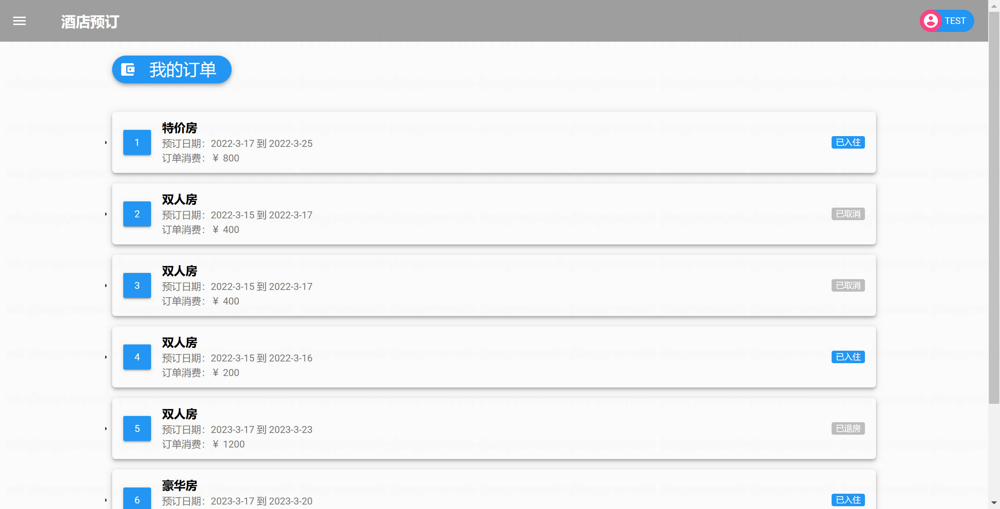
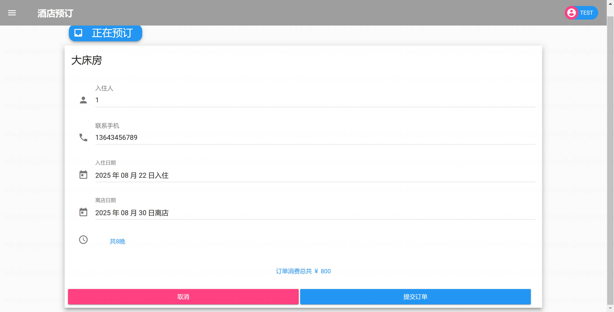
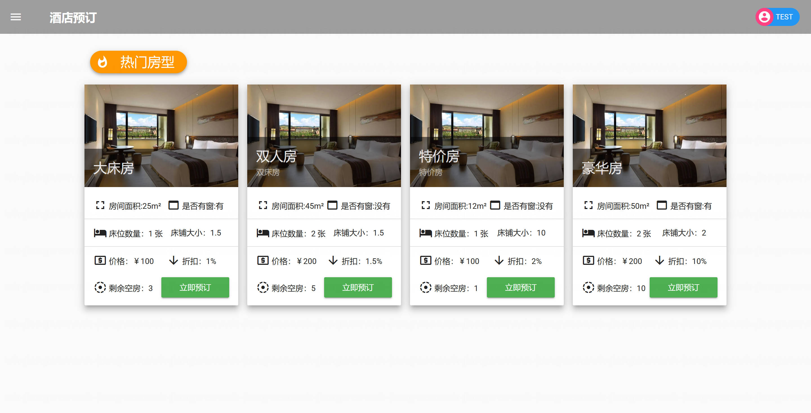

